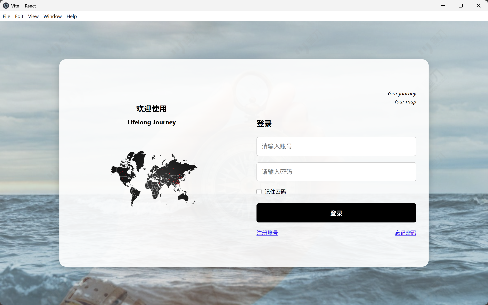
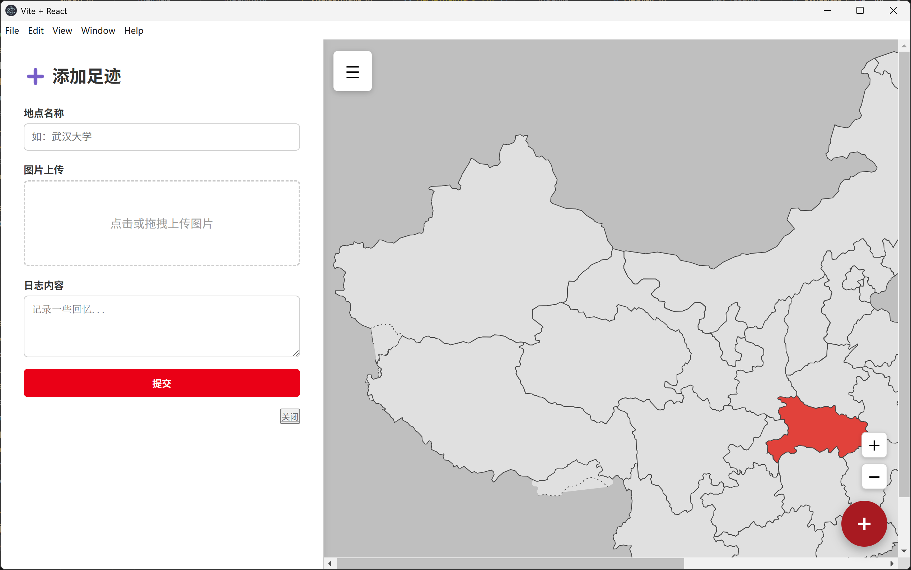
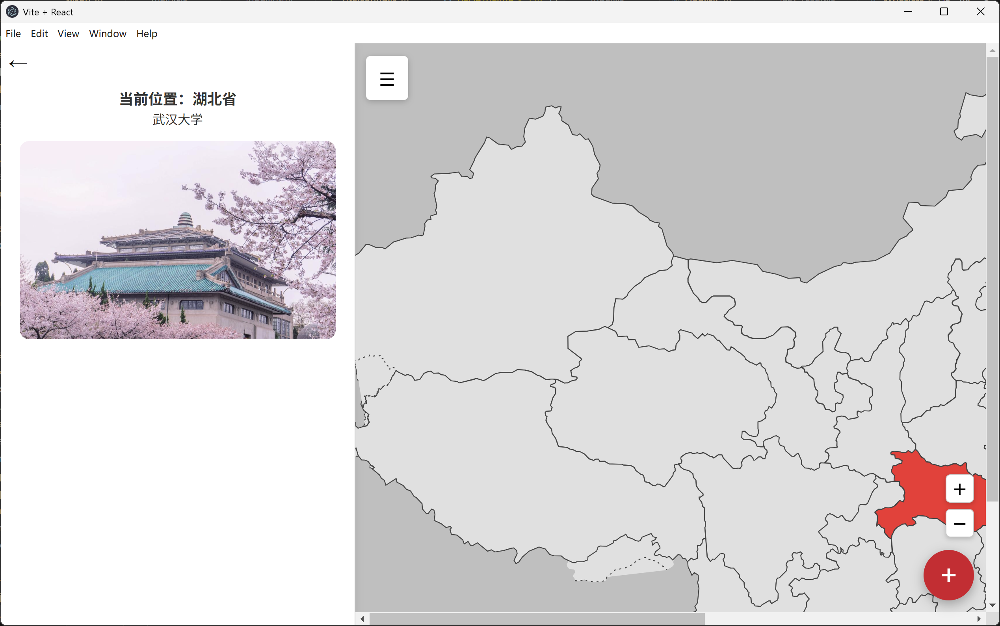

# 🧭 Lifelong Journey
运行截图：




---

## 🧱 前端架构

| 技术 | 说明 |
|------|------|
| **React** | 构建用户界面，采用组件化开发 |
| **Vite** | 新一代前端构建工具，极速热更新，快速打包 |
| **JavaScript (ES6+)** | 项目主要编程语言 |
| **Electron** | 构建跨平台桌面应用 |
| **HTML5 + CSS3** | 页面结构与样式 |
| **纯 CSS（非 CSS 框架）** | 所有样式均为手写，集中在 `styles.css` 中管理 |
| **模块化资源管理** | 使用 ES 模块方式导入本地图片等资源，如：`import avatar from './assets/avatar.png'` |

---

## 🖥️ 桌面端运行环境

| 技术 | 说明 |
|------|------|
| **Electron Builder** | 打包和发布 Electron 应用 |
| **Node.js** | Electron 应用运行环境（用于打包/开发） |
| **npm/yarn** | 包管理工具，安装依赖和运行脚本 |
| **Windows 10+** | 桌面客户端开发及运行环境（当前打包平台） |

## 📁 项目目录结构

```text
Lifelong-Journey/
├── src/
│   ├── assets/         # 静态资源（地图、头像图等）
│   ├── App.jsx         # 路由配置入口
│   ├── Login.jsx       # 登录页
│   ├── Home.jsx        # 主页面（包含地图、标记功能）
│   ├── Sidebar.jsx     # 左侧栏组件（用户信息与统计）
│   ├── AddPanel.jsx    # 添加足迹的右侧栏面板
│   ├── styles.css      # 全局样式文件
│   └── main.jsx        # React 渲染入口
├── electron/
│   └── main.cjs        # Electron 主进程入口（桌面版）
├── public/             # 公共静态资源
├── dist/               # 构建产物（自动生成）
├── vite.config.js      # Vite 配置文件
├── package.json        # 项目依赖与脚本配置
└── README.md           # 项目说明文档
```
## 📦 安装与运行

 安装依赖

```bash
npm install
```
启动开发环境
```bash
npm run dev
```
构建生产环境前端页面
```bash
npm run build
```
🖥 打包为桌面应用

 本项目内含 Electron 主进程文件，可配合 electron-builder 打包为桌面客户端。

步骤示意：
```bash

npm install electron electron-builder --save-dev
npm run electron:dev
```
