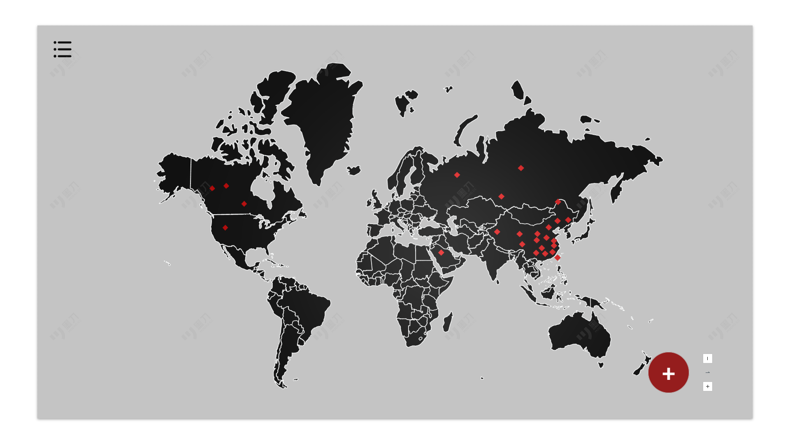

# React + Vite

This template provides a minimal setup to get React working in Vite with HMR and some ESLint rules.

Currently, two official plugins are available:

- [@vitejs/plugin-react](https://github.com/vitejs/vite-plugin-react/blob/main/packages/plugin-react) uses [Babel](https://babeljs.io/) for Fast Refresh
- [@vitejs/plugin-react-swc](https://github.com/vitejs/vite-plugin-react/blob/main/packages/plugin-react-swc) uses [SWC](https://swc.rs/) for Fast Refresh

## Expanding the ESLint configuration

If you are developing a production application, we recommend using TypeScript with type-aware lint rules enabled. Check out the [TS template](https://github.com/vitejs/vite/tree/main/packages/create-vite/template-react-ts) for information on how to integrate TypeScript and [`typescript-eslint`](https://typescript-eslint.io) in your project.
# 🌍 Lifelong Journey

> 一款基于 **React + Tailwind CSS + Vite + Electron** 构建的桌面端旅程记录应用，支持用户登录、地图缩放、地点统计和数据可视化。

---

## 📸 项目预览
注册页：

首页界面（含侧边栏）：



---

## 🚀 技术栈

- ⚛️ React 18
- ⚡ Vite 4+
- 🎨 Tailwind CSS 3+
- 💻 Electron（用于打包为桌面应用）
- 🔁 React Router DOM（用于页面跳转）
- 🎯 Node.js（运行依赖）

---
## 📁 目录结构

```text
Lifelong-Journey/
├── src/
│   ├── assets/         # 项目资源文件（地图图、头像图）
│   ├── App.jsx         # 路由入口
│   ├── Login.jsx       # 登录页面
│   ├── Home.jsx        # 主地图页面
│   ├── Sidebar.jsx     # 侧边栏组件
│   └── main.jsx        # React 挂载入口
├── electron/           # Electron 主进程文件（可选）
├── dist/               # 构建输出目录（自动生成）
├── public/             # 静态资源
├── package.json        # 项目配置
├── vite.config.js      # Vite 配置
└── README.md           # 项目说明文档
```


---

## 📦 安装与运行

### 安装依赖

```bash
npm install
```
启动开发环境
```bash
npm run dev
```
构建生产环境前端页面
```bash
npm run build
```
🖥 打包为桌面应用
需安装 electron 和 electron-builder，并配置 main 文件路径。
尚未实现